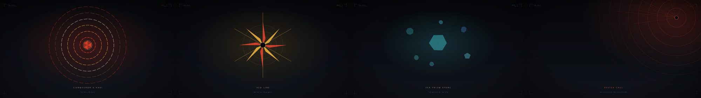

# One Piece for Omarchy

A dark [Omarchy](https://omarchy.org) theme in a One Piece inspired palette, paired with a matching set of abstract wallpapers — no character art or drawn scenes, just concentric rings, crystalline fields, radial bursts, and gradient bands referencing Haki, the Grand Line, and Gear Fifth.



## Install

```bash
omarchy theme install https://github.com/iam-wisman/omarchy-one-piece-theme.git
```

## Wallpapers

11 wallpapers ship in `backgrounds/`, each carrying a shared corner-bracket "instrument bezel" frame so the set reads as one collection. Cycle through them with `omarchy theme bg next`.

| # | Name | Motif |
|---|------|-------|
| 01 | Conqueror's Haki | concentric rings converging on a faceted core |
| 02 | Observation Haki | crystalline shard field around a hex core |
| 03 | Red Line | radial mandala / sunburst |
| 04 | Grand Line | flowing aurora gradient bands |
| 05 | Voice of All Things | constellation node network |
| 06 | Gear Fifth | halftone radial burst |
| 07 | Calm Belt | dual ring interference pattern |
| 08 | Sea Prism Stone | faceted gem cluster |
| 09 | Poneglyph | ancient rune seals |
| 10 | Den Den Mushi | logarithmic spiral |
| 11 | Buster Call | asymmetric corner alarm burst |

## Palette

- Background: `#10141b`
- Foreground: `#ece3cc`
- Accent: `#e8432c`
- Red: `#e8432c`
- Yellow: `#f2b53d`
- Orange: `#f3823f`
- Green: `#49a869`
- Cyan: `#3fb8c4`
- Blue: `#3d6ea8`
- Magenta: `#b072c4`
- Brown: `#8a5a3a`

## License

MIT © iam-wisman. This is an unofficial fan tribute — One Piece is the property of Eiichiro Oda, Shueisha, and Toei Animation; no affiliation is claimed or implied.
